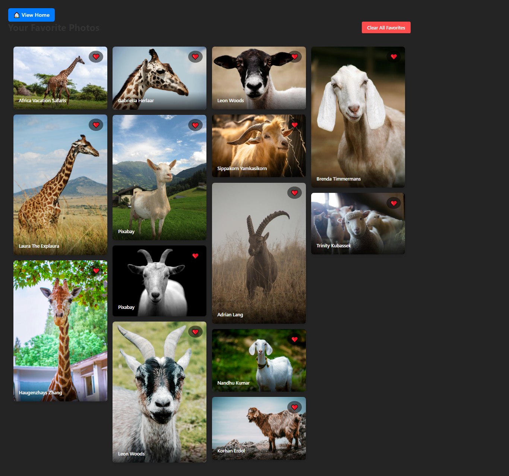

### 📄 `README.md`

```md
# 📷 Pexels Studio - A Beautiful Photo Search App

Pexels Studio is a sleek photo browsing and search application built with **React**, **TypeScript**, **Zustand** for state management, and the **Pexels API**. Users can search, filter, favorite, and view high-resolution images in a **responsive masonry layout**, similar to the real Pexels experience.

---

## 🚀 Features

- 🔍 **Search Photos** using the Pexels API
- 🎨 **Filter by color** and **orientation** (portrait, landscape, square)
- ❤️ **Favorite photos** with persistent state using `localStorage`
- 🧱 **Masonry grid layout** for displaying images
- 📱 **Responsive UI** (mobile & desktop friendly)
- 🧭 **Routing** with React Router (Home & Favorites pages)
- ⚙️ **Zustand** for global state and `localStorage` persistence
- 🔁 **Load More** functionality for infinite scrolling

---

## 🛠 Tech Stack

| Technology         | Purpose                               |
| ------------------ | ------------------------------------- |
| React + TypeScript | Frontend UI and typings               |
| Zustand            | Global state management + persistence |
| React Router       | Client-side routing                   |
| CSS Modules        | Component-scoped styling              |
| Pexels API         | Photo data & image assets             |

---

## 📸 Screenshots

| Home Page                                | Favorites Page                                     |
| ---------------------------------------- | -------------------------------------------------- |
|  |  |

---

## 🧩 Project Structure
```

src/
├── components/ # Reusable UI components
│ ├── Filters.tsx
│ ├── MasonryGrid.tsx
│ ├── PhotoCard.tsx
│ └── SearchBar.tsx
├── stores/ # Zustand store & types
│ └── useFavoritesStore.ts
├── hooks/ # Custom hooks
│ └── usePexelsApi.ts
├── pages/ # Pages for routing
│ ├── HomePage.tsx
│ └── FavoritesPage.tsx
├── utils/ # Utilities
│ └── debounce.ts
├── App.tsx # Routes setup
├── main.tsx # App entry point
└── index.css

````

---

## 🔧 Setup & Installation

### 1. Clone the Repo

```bash
git clone https://github.com/mikael0907/pexels-studio
cd pexels-studio
````

### 2. Install Dependencies

```bash
npm install
```

### 3. Get Your Pexels API Key

- Visit [https://www.pexels.com/api/](https://www.pexels.com/api/)
- Create an account or log in
- Generate your API key

### 4. Create `.env` File

Create a `.env` file in the root with:

```env
VITE_PEXELS_API_KEY=your_pexels_api_key_here
```

### 5. Start the Dev Server

```bash
npm run dev
```

Visit: [http://localhost:5173](http://localhost:5173)

---

## 💡 Usage

- Search photos using the top bar.
- Use filters to narrow results by color or orientation.
- Click the 🤍 icon to favorite a photo. It will turn red ❤️.
- Visit the **Favorites Page** by clicking the "❤️ View Favorites" button.
- All favorites are saved in your browser via `localStorage`.

---

## 📦 Build for Production

```bash
npm run build
```

To preview the production build:

```bash
npm run preview
```

---

## 🧠 How Favorites Work

- Favorites are stored globally using [Zustand](https://github.com/pmndrs/zustand).
- Zustand is configured with persistence middleware so that:

  - The state is saved in `localStorage`
  - Your favorites stay even after refresh or closing the tab

---

## ✨ Credits

- [Pexels](https://www.pexels.com) for the API and beautiful images
- [Zustand](https://github.com/pmndrs/zustand) for lightweight global state
- [React Router](https://reactrouter.com) for routing

---

## 📄 License

This project is open-source and available under the [MIT License](LICENSE).

---

## 🤝 Contributing

Contributions, issues, and feature requests are welcome!

1. Fork the project
2. Create your feature branch (`git checkout -b feature/awesome`)
3. Commit your changes (`git commit -m 'Add something cool'`)
4. Push to the branch (`git push origin feature/awesome`)
5. Open a Pull Request

---

## 🌐 Live Demo

> Coming soon...

---

## 🙋‍♂️ Author

Built by Chisom. https://github.com/mikael0907/

```

---


```
